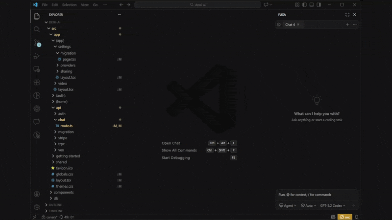
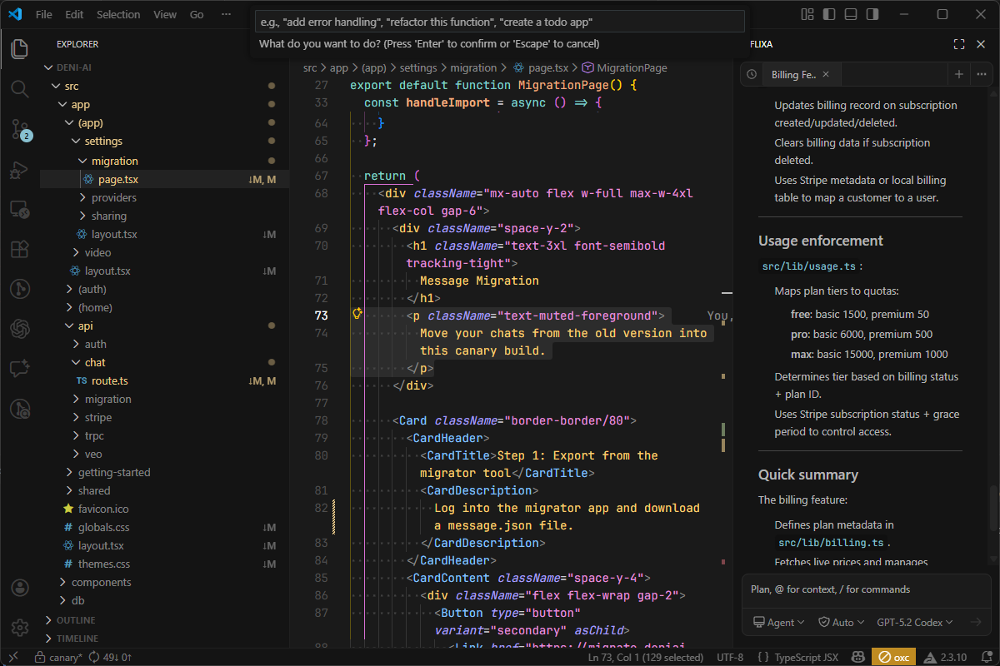

# Flixa

AI-powered code implementation assistant for VS Code.

## Showcase

### Try: Agent Mode

Rest assured, you can take a break safely.

### Inline editing

## Features

- AI chat interface in sidebar
- Inline code editing with `Ctrl+I` / `Cmd+I`
- Agent mode with shell command execution
- Safety agent mode (Auto Approve)
- Diff preview and apply
- Auto context (file list, git status, package.json, tsconfig.json)
- Multiple AI model support (OpenAI, Anthropic, Google, etc.)

## License

MIT
